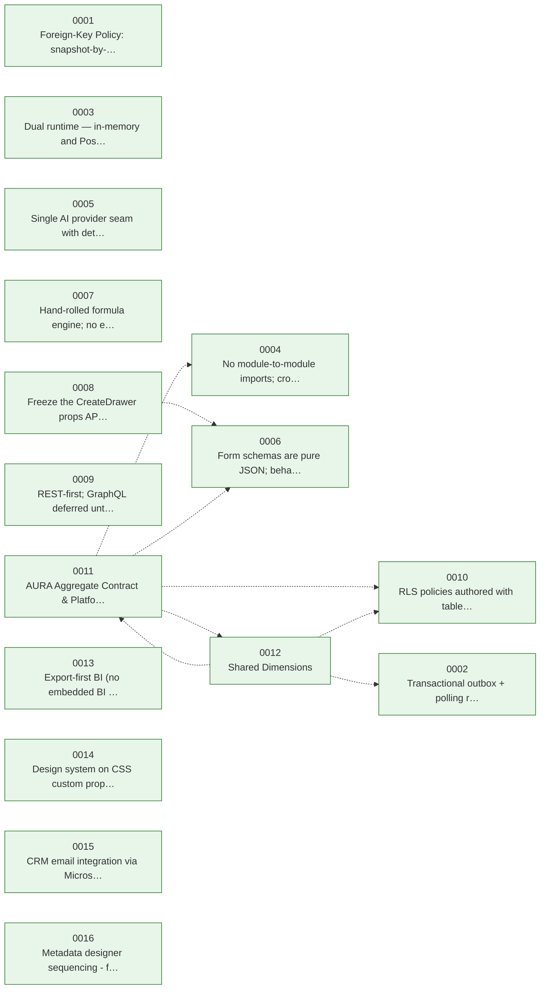

# ADR relationship graph

<!-- GENERATED by `pnpm adr:graph --write`. Solid = supersedes, dashed = related. -->

```mermaid
graph LR
  0001["0001<br/>Foreign-Key Policy: snapshot-by-…"]
  0002["0002<br/>Transactional outbox + polling r…"]
  0003["0003<br/>Dual runtime — in-memory and Pos…"]
  0004["0004<br/>No module-to-module imports; cro…"]
  0005["0005<br/>Single AI provider seam with det…"]
  0006["0006<br/>Form schemas are pure JSON; beha…"]
  0007["0007<br/>Hand-rolled formula engine; no e…"]
  0008["0008<br/>Freeze the CreateDrawer props AP…"]
  0009["0009<br/>REST-first; GraphQL deferred unt…"]
  0010["0010<br/>RLS policies authored with table…"]
  0011["0011<br/>AURA Aggregate Contract & Platfo…"]
  0012["0012<br/>Shared Dimensions"]
  0013["0013<br/>Export-first BI (no embedded BI …"]
  0014["0014<br/>Design system on CSS custom prop…"]
  0015["0015<br/>CRM email integration via Micros…"]
  0016["0016<br/>Metadata designer sequencing - f…"]
  0008 -.-> 0006
  0011 -.-> 0004
  0011 -.-> 0006
  0011 -.-> 0010
  0011 -.-> 0012
  0012 -.-> 0011
  0012 -.-> 0002
  0012 -.-> 0010
  classDef accepted fill:#e8f5e9,stroke:#2e7d32;
  class 0001,0002,0003,0004,0005,0006,0007,0008,0009,0010,0011,0012,0013,0014,0015,0016 accepted;
```
