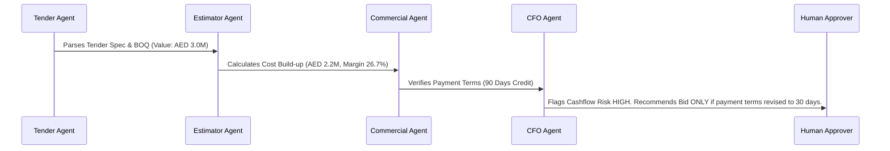
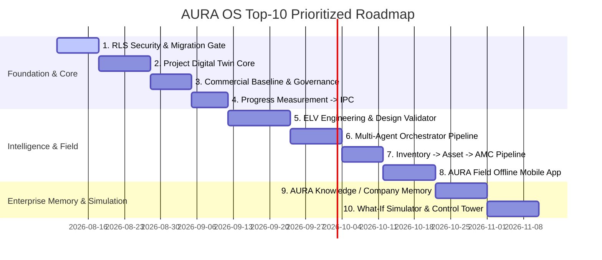

# 🏛️ AURA OS — Master Architectural Dossier & Full System Specification
## The 5-Layer AI-Native Digital Operating System for ELV & Systems Integration Contractors

> **Date:** August 8, 2026  
> **Platform Version:** 6.0.0-PROD (Digital ELV / Systems Integrator Enterprise Edition)  
> **Target Architecture:** 5-Layer Platform (ERP Foundation → Project Digital Twin → AI Brain → ELV Intelligence → Field Workforce)  
> **Monorepo Status:** `pnpm typecheck` **47 of 47 tasks successful** (0 compilation errors across 25 packages).  
> **Test Suite Status:** **46 of 46 test tasks passed** (0 failures).  
> **Database Status:** **219 PostgreSQL SQL Migrations applied and active**.

---

## 1. Executive Summary & Strategic Paradigm Shift

AURA OS is engineered specifically for Extra Low Voltage (ELV), MEP, and Systems Integration enterprise contractors. 

Traditional enterprise resource planning (ERP) platforms treat business operations as disconnected module "islands" (CRM, Finance, Inventory, Projects). In ELV systems integration, projects are **technical systems integration projects** where a change in a single engineering parameter (e.g., adding 50 IP cameras) immediately impacts switch port capacity, storage bandwidth, PoE budgets, labor hours, profit margins, cash flow schedules, and warranty commitments.

AURA OS eliminates module isolation by establishing a **5-Layer Architecture** anchored around the **Project Digital Twin**. Every ELV project exists as a single, continuous digital container flowing automatically from Lead $\rightarrow$ Tender $\rightarrow$ Engineering Design $\rightarrow$ Procurement $\rightarrow$ Installation $\rightarrow$ Quality Testing $\rightarrow$ Automatic Handover $\rightarrow$ AMC Maintenance.

```
                    AURA OS MASTER ARCHITECTURE
                             │
        ┌────────────────────┼────────────────────┐
        ▼                    ▼                    ▼
   LAYER 1: ERP CORE    LAYER 2: DIGITAL TWIN   LAYER 3: AI BRAIN
   (219 Migrations)   (Unified Container)  (Orchestrator)
        │                    │                    │
        └────────────────────┼────────────────────┘
                             ▼
                 LAYER 4: ELV ENGINEERING INTELLIGENCE
                 (Design Validator & Digital BOM)
                             │
                             ▼
                  LAYER 5: AUTONOMOUS FIELD WORKFORCE
                  (AURA Field & Smart Camera Evidence)
```

---

## 2. Architecture & Monorepo Substrate Verification

### 2.1 Monorepo Structure & Package Inventory
The monorepo (`pnpm` + `turbo`) enforces strict downward dependency constraints:
`shared` (pure framework-free domain) $\leftarrow$ `core` (kernel) $\leftarrow$ `modules/*` (business domains) $\leftarrow$ `apps/api` (NestJS HTTP host) & `apps/web` (Next.js App Router UI).

| Package | Scope | Description & Key Exports |
| :--- | :--- | :--- |
| `@aura/shared` | Shared Domain | Pure rule files (`opportunity-health.ts`, `forecast-snapshot.ts`, `eosb.ts`, `wps.ts`). |
| `@aura/core` | Core Kernel | Multi-tenancy, RBAC/ABAC guards, outbox relay, workflow engine, numbering, audit log. |
| `@aura/sdk` | OpenAPI SDK | Spec-generated TypeScript SDK with `AuraApiError` and idempotency headers. |
| `@aura/api` | NestJS Host | ~90 HTTP controllers, global DTO validation pipes, Swagger UI at `/api/docs`. |
| `@aura/web` | BFF & Next.js UI | App Router, 151 pages, 196 components, multi-tab layout shell (`AppShell.tsx`). |
| `@aura/crm` | Module | CRM, Accounts, Contacts, Leads, Opportunity Depth, Quotations, Sales Radar. |
| `@aura/tendering` | Module | Tenders, BOQs, Rate Build-ups, Bid-Score Matrix, Win-Loss Analysis. |
| `@aura/contracts` | Module | Contracts, Bonds, Obligations, Payment Certificates (IPC), Clauses. |
| `@aura/projects` | Module | Projects, WBS, CBS, Interactive Gantt Schedule Planner, Variations, Closeout. |
| `@aura/procurement` | Module | PRs, RFQs, Supplier Quote Comparison, POs, 3-Way Match Port, Frameworks. |
| `@aura/finance` | Module | Double-entry GL, Journals, AP Invoices, Customer AR Invoices, PDCs, Budgets, Period Close. |
| `@aura/inventory` | Module | Stock (WAC Valuation), Goods Receipts (GRN), Stock Transfers, Serial Units, Bins. |
| `@aura/subcontracts` | Module | Subcontract Agreements, Progress Claims, Back-charges, Retention Release. |
| `@aura/engineering` | Module | Drawings, RFIs, Submittals, Design Changes, Technical Queries, BIM Models. |
| `@aura/quality` | Module | Inspection Requests (IR), NCRs, Snag List, ITPs, Material Approvals. |
| `@aura/site` | Module | Daily Site Reports, Labour & Trade Returns, Site Instructions. |
| `@aura/hse` | Module | Risk Assessments (JSA 5x5 Matrix), Incidents, Permits-to-Work (PTW), Toolbox Talks. |
| `@aura/assets` | Module | Asset Register, Depreciation Schedules, Asset Inspections, Asset Disposals. |
| `@aura/fleet` | Module | Vehicles, Maintenance, Telematics, Traffic Fines, Salik Tolls. |
| `@aura/amc` | Module | Preventive Maintenance (PPM), Service Tickets, Work Orders, AMC Contracts. |
| `@aura/doccontrol` | Module | Transmittals, Submittals, Project Correspondence. |
| `@aura/commissioning`| Module | Witnessed Commissioning Test-Points, System Testing. |
| `@aura/market-intel` | Module | Sourcing Price Catalogues, Market Benchmark Rates. |
| `@aura/intelligence` | Module | AI Context Engine, Guardrails, Autonomy Service, Vector Store, MCP Server. |

### 2.2 Event Store & Transactional Outbox
All aggregate state changes append domain events to `aura_events` within the same DB transaction using the **Transactional Outbox Pattern** (`core/src/events/outbox-relay.ts`). 

**20 Active Cross-Module Event Reactors** execute idempotently (`apps/api/src/events/cross-module-subscriber.ts`):
1. `crm.lead.converted` $\rightarrow$ Seeds Opportunity & Account records.
2. `crm.opportunity.stage_changed (won)` $\rightarrow$ Triggers Tender creation.
3. `tendering.tender.awarded` $\rightarrow$ Triggers Contract creation.
4. `contracts.contract.signed` $\rightarrow$ Auto-creates Project, seeds WBS root, and syncs CBS nodes from Tender BOQ.
5. `procurement.grn.created` $\rightarrow$ Updates Stock, posts WAC Inventory GL journal, auto-suggests AP Invoice.
6. `contracts.ipc.certified` $\rightarrow$ Auto-drafts Customer AR Invoice in Finance.
7. `projects.variation.approved` $\rightarrow$ Updates Contract value and CBS budget allocations.
8. `engineering.design_change.approved` $\rightarrow$ Auto-drafts Project Variation Request.
9. `subcontracts.claim.certified` $\rightarrow$ Auto-drafts AP Invoice for Subcontractor.
10. `inventory.stock.low` $\rightarrow$ Auto-drafts Purchase Request (PR) for replenishment.
11. `assets.asset.disposed` $\rightarrow$ Posts Asset Disposal Gain/Loss to General Ledger.
12. `amc.workorder.completed` $\rightarrow$ Auto-drafts AR Customer Invoice.
13. `quality.ncr.issued` $\rightarrow$ Flags Project Health Risk alert.
14. `quality.ncr.closed` $\rightarrow$ Clears QA risk flag on Project Health Index.
15. `site.daily_report.submitted` $\rightarrow$ Updates WBS labor progress & actual hours.
16. `hse.incident.reported` $\rightarrow$ Triggers HSE Alert & Executive Briefing notification.
17. `crm.contract.completed` $\rightarrow$ Auto-generates S9 AMC Renewal Opportunity signal.
18. `projects.project.completed` $\rightarrow$ Triggers Handover Package generation & Expansion signal.
19. `finance.invoice.paid` $\rightarrow$ Updates AR Aging & Project Cashflow actuals.
20. `intelligence.insight.generated` $\rightarrow$ Appends advisory suggestion to User Workspace Radar.

---

## 3. Exhaustive 19-Module Deep-Dive Inventory

```
┌────────────────────────────────────────────────────────────────────────────────────────┐
│                        PROJECT DIGITAL TWIN CONTAINER                                  │
├───────────────────┬───────────────────┬───────────────────┬────────────────────────────┤
│ 1. CRM            │ 6. Finance        │ 11. HR            │ 16. Fleet                  │
│ 2. Tendering      │ 7. Inventory      │ 12. Quality       │ 17. DocControl             │
│ 3. Contracts      │ 8. Subcontracts   │ 13. Site          │ 18. Market Intelligence    │
│ 4. Projects       │ 9. Engineering    │ 14. HSE           │ 19. Intelligence (AI)      │
│ 5. Procurement    │ 10. AMC           │ 15. Assets        │                            │
└───────────────────┴───────────────────┴───────────────────┴────────────────────────────┘
```

### 3.1 Commercial & Revenue Domain
1. **CRM & Lead OS (`/crm`, `/crm/leads`, `/crm/accounts`, `/crm/quotations`)**
   - *Aggregates:* Account, Contact, Lead, Opportunity, Signal, Quotation, Growth Signal.
   - *Depth:* **90% (Deep)**. Complete S1–S9 revenue lifecycle. Includes maker-checker quotation approval and stakeholder influence maps.
2. **Tendering & Estimating (`/tendering/tenders`)**
   - *Aggregates:* Tender, BOQ, Estimate, Rate Build-up, Bid Score, Win-Loss Record.
   - *Depth:* **70% (Deep Commercial Engine)**. BOQ item management; rate build-up models direct material, labor, plant, subcontracting, indirects, overheads, and profit.
3. **Market Intelligence (`/crm/market-intelligence`)**
   - *Aggregates:* Market Item, Price Catalogue, Vendor Benchmark.
   - *Depth:* **60% (Medium)**. Sourcing price catalogues and unit rate benchmarks.

### 3.2 Operations & Delivery Domain
4. **Contracts Register (`/contracts/contracts`)**
   - *Aggregates:* Contract, Bond, Clause, Obligation, Payment Certificate (IPC).
   - *Depth:* **65% (Deep)**. IPC certification auto-triggers AR invoice; manages bank guarantees, retention, and performance bonds.
5. **Projects & Execution (`/projects/projects`)**
   - *Aggregates:* Project, WBS, CBS, Schedule (Gantt), Variation, Closeout, EOT.
   - *Depth:* **72% (Deep Execution Spine)**. CBS synced from BOQ; variations; interactive Gantt schedule planner with baseline tracking.
6. **Procurement (`/procurement/prs`, `/procurement/pos`)**
   - *Aggregates:* Supplier, Purchase Request (PR), RFQ, Purchase Order (PO), Framework.
   - *Depth:* **72% (Deep)**. PR $\rightarrow$ RFQ $\rightarrow$ Supplier Quote Comparison $\rightarrow$ PO award; 3-way match port in Finance.
7. **Inventory & Logistics (`/inventory`)**
   - *Aggregates:* Stock Item, Goods Receipt (GRN), Stock Transfer, Serial Unit, Warehouse Bin.
   - *Depth:* **70% (Deep)**. Weighted Average Cost (WAC) valuation; perpetual GL movement postings; serial unit tracking.
8. **Subcontracts (`/subcontracts`)**
   - *Aggregates:* Subcontract Agreement, Progress Claim, Backcharge, Retention Release.
   - *Depth:* **72% (Medium-Deep)**. Subcontractor progress claims certification $\rightarrow$ AP invoice reactor.
9. **Engineering (`/engineering`)**
   - *Aggregates:* Drawing, RFI, Submittal, Design Change, Technical Query, BIM Model.
   - *Depth:* **78% (Deep Post-Award)**. Tabbed control hub covering drawings, RFIs, submittals, design changes, and BIM models.

### 3.3 Finance & Commercial Billing Domain
10. **Finance & General Ledger (`/finance`)**
    - *Aggregates:* Account, Journal, AP Invoice, Customer AR Invoice, Budget, Period Close, PDC, Tax.
    - *Depth:* **80% (Very Deep)**. Double-entry GL trigger, PDC management, WAC inventory GL postings, AR/AP aging exports.

### 3.4 Field Execution, Quality & HSE Domain
11. **Quality OS (`/quality/inspections`, `/quality/ncrs`, `/quality/snags`)**
    - *Aggregates:* Inspection Request (IR), NCR, Snag List, ITP, Material Approval.
    - *Depth:* **78% (Deep)**. Photo dropzones, digital signature pads, inspection workflows.
12. **Site Operations (`/site/daily-reports`)**
    - *Aggregates:* Daily Site Report, Labour Return, Site Instruction, Equipment Consumption.
    - *Depth:* **68% (Medium-Deep)**. Foreman daily diary, man-hour trade rollups.
13. **HSE & Safety (`/hse/risk-assessments`)**
    - *Aggregates:* Risk Assessment (JSA), Incident, Permit-to-Work (PTW), Toolbox Talk.
    - *Depth:* **72% (Medium-Deep)**. 5x5 hazard matrix scoring, permit-to-work closeout.
14. **Asset Management (`/assets`)**
    - *Aggregates:* Asset Register, Depreciation Schedule, Inspection, Asset Disposal.
    - *Depth:* **68% (Medium)**. Asset disposal gain/loss GL calculation; maintenance schedules.
15. **Fleet Operations (`/fleet`)**
    - *Aggregates:* Vehicle, Maintenance, Fuel Log, Telematics, Traffic Fine, Salik Toll.
    - *Depth:* **70% (Medium)**. Telematics hub, automated Salik/fine tracking.
16. **HR & Payroll (`/hr`)**
    - *Aggregates:* Employee, Attendance, Timesheet, Expense Claim, EOSB, WPS Payroll Run.
    - *Depth:* **72% (Medium-Deep)**. GCC statutory compliance (WPS payroll, End of Service Gratuity calculation).
17. **AMC / Service Operations (`/amc`)**
    - *Aggregates:* Work Order, Ticket, PPM Schedule, Escalation.
    - *Depth:* **62% (Medium)**. Preventive maintenance dispatch; `workorder.completed` $\rightarrow$ AR reactor.
18. **Document Control (`/doccontrol`)**
    - *Aggregates:* Transmittal, Submittal, Project Correspondence.
    - *Depth:* **65% (Medium)**. Document distribution & revision tracking.
19. **Commissioning & Handover (`/commissioning`, `/handover`)**
    - *Aggregates:* Commissioning Test Point, Handover Package, Witness Sign-Off.
    - *Depth:* **75% (Deep)**. Witnessed test points, client signature pads, handover package compilation.

---

## 4. Digital ELV Workforce & Multi-Agent Collaboration

### 4.1 7 Specialized AI Agents
1. 🎯 **Sales Radar Agent**: Scans CRM signals & portal tenders to detect high-value leads & schedule discovery meetings.
2. 📄 **Tender Intelligence Agent**: Parses multi-page tender PDF specs/BOQs; outputs Bid/No-Bid decisions.
3. 📐 **ELV Estimator Agent**: Matches BOQ specs against price catalogues; builds WBS cost & margin structures.
4. 💼 **Commercial Quotation Agent**: Evaluates margin safety; dispatches quotes to Human Approval Gates.
5. 👔 **Executive Copilot**: Generates "Good Morning CEO" briefing across pipeline, project risks, and AR collections.
6. 🚜 **PM Delay Risk Agent**: Analyzes Gantt schedule variances; recommends alternative approved suppliers.
7. 💰 **CFO Agent**: Calculates 90-day cashflow forecasts; monitors overdue IPC collections & margin erosion.

### 4.2 Multi-Agent Orchestrator Pipeline
Agents execute in a structured, collaborative sequence rather than isolated silos:



### 4.3 AI Action Governance Matrix
Every AI action is evaluated against a risk matrix before execution:

| Risk Level | Trigger Criteria | Action Protocol |
| :--- | :--- | :--- |
| **LOW** | Draft creation, tender parsing, task scheduling, alert generation | **Auto-Execute** |
| **MEDIUM** | PR generation, inspection scheduling, customer reminder dispatch | **User Confirmation Needed** |
| **HIGH** | Quotation dispatch, contract modification, payment release, GL posting | **Strict Human Approval Gate Required** |

---

## 5. The 24 Master Platform Innovations (Full Exhaustive Specification)

### 🛰️ 1. AURA "Control Tower" & Decision Engine
Single executive command center for CEO/PMs converting static dashboards into an interactive **Decision Engine**:
- Real-time aggregate view: Sales Pipeline, Active Projects, AR Collections, Cash Flow.
- **Predictive Risk Alerts:** E.g., *"🔴 Project X: 73% probability of delay. Root Cause: PO #124 delayed 11 days. Gantt Impact: 8 days. Financial Risk: AED 84K. Recommended Action: Supplier escalation + alternate vendor selection."*

### 🔍 2. "AURA WHY" — Explainable ERP
Every financial metric and variance is click-expandable to reveal the exact mathematical and operational root causes:
$$\text{Project Margin: 14.7\%} \xrightarrow{\text{Why?}} \begin{cases} \text{Original Margin} & 22.4\% \\ \text{Material Variance} & -3.1\% \\ \text{Labour Variance} & -2.2\% \\ \text{Variation Leakage} & -1.4\% \\ \text{Procurement Variance} & -1.0\% \end{cases}$$
Accompanied by natural language AI explanation of root-cause drivers.

### ⚙️ 3. Business Rules Engine (UI-Configurable Rules)
Decouples business logic from TypeScript code services into a central Rules Engine editable via Admin UI:
- *Example Rule:* `IF Quotation > AED 500,000 THEN Require CFO Approval AND Require Commercial Director Approval AND IF Margin < 15% THEN Trigger Board Escalation`.

### 🛡️ 4. Policy as Code (ABAC Segregation of Duties)
Enforces Attribute-Based Access Control (ABAC) defining `WHO can do WHAT on WHICH OBJECT under WHICH CONDITION`:
- *Example Policy:* `Project Manager CAN approve Inspection Request (IR) BUT CANNOT approve an IR where created_by == current_user_id`.

### ⚡ 5. Approval Intelligence Card
Transforms approval requests from plain `Approve/Reject` buttons into rich executive cards:
- Displays Request Value, Budget Allowance, Variance %, Historical Vendor Performance, Delivery Lead Time, Risk Level, and **1-Click AI Approval Recommendation**.

### 🎯 6. AURA "Exception-First UI"
Replaces dense 500-row tables with a persona-focused **My Work / Critical Exceptions** dashboard:
- Categorizes work into `🔴 Critical (3)` $\cdot$ `🟠 Attention (7)` $\cdot$ `🟢 On Track (18)`.
- Direct focus on delayed POs, uncertified IPCs, and overdue NCRs.

### 🔮 7. Predictive Procurement Engine
Monitors inventory consumption rates and supplier lead times to forecast stockouts before they happen:
- $\text{Current Stock (12)} + \text{Usage Rate (8/wk)} + \text{Lead Time (14d)} \longrightarrow \text{"⚠️ Stockout predicted in 10 days"}$.
- Automatically generates draft Purchase Requests (PR) for approval.

### 📦 8. Digital BOM (Bill of Materials)
Models every technical system (CCTV, Access Control, Cabling, BMS, PA/VA) as a structured **Digital BOM**:
- Carries Specification, Manufacturer, Model, Quantity, Unit Cost, Installation Labor, Warranty, and Serialized Asset ID cleanly across `BOQ` $\rightarrow$ `Procurement` $\rightarrow$ `Installation` $\rightarrow$ `Handover`.

### 📐 9. System Design Validator (Engineering Intelligence)
Validates physical ELV engineering constraints against manufacturer specs:
- Checks PoE Switch Power Budget, Port Capacity, VMS Bandwidth, NVR Storage TB, Fiber Uplink SFPs, IP Addressing, UPS Load.
- *Error Trigger:* `❌ PoE Power Budget exceeded by 18% on Switch SW-03 (370W / 450W capacity)`.

### 🇦🇪 10. Automatic SIRA / Local Regulatory Compliance Assistant
Region-specific regulatory engine evaluating ELV compliance (e.g. SIRA / ADMCC / Civil Defense):
- Generates **SIRA Readiness Score (e.g. 87%)** and identifies missing camera schedules, retention days, or test certificates.

### 📝 11. Automatic Method Statement & ITP Generator
Automatically generates draft technical documentation directly from approved BOQ & Digital BOM:
- Method Statements, Inspection Test Plans (ITP), Inspection Checklists, Testing Procedures, JSA Risk Assessments.

### 🚩 12. AI Tender "Red Flag Scanner"
Parses multi-page tender PDFs/BOQs to extract hidden commercial, technical, and contract risks:
- Flags unlimited liability, 90-day payment terms, ambiguous specs, or missing BOQ items, generating a composite **Tender Risk Score (e.g. 81/100 - HIGH RISK)**.

### 📑 13. Contract-to-Execution Intelligence
Parses legal contract PDFs upon signature to automatically extract operational obligations:
- Warranty timelines, monthly progress report deadlines, retention release dates $\rightarrow$ Auto-creates recurring tasks, owners, and escalation rules.

### ⚖️ 14. Obligation Engine Core Service
Centralized service tracking all contractual obligations:
- Attributes: `Owner`, `Due Date`, `Penalty Value`, `Required Evidence`, `Escalation Path`, `Linked Document`.

### 🌐 15. Client Portal (AURA Client)
Dedicated external portal for project clients:
- Clean visibility into Project Progress, Variations, Inspection Sign-offs, NCRs, IPC Invoices, Handover Dossiers (eliminating manual email updates).

### 🏭 16. Supplier Portal (AURA Supplier)
External self-service portal for vendors and subcontractors:
- Receive RFQs, submit Quotes, acknowledge POs, issue Delivery Notes, and track AP Invoice payments.

### 📜 17. AURA Event Timeline (Unified Audit Trail)
Every domain aggregate records a unified, chronological timeline:
- Captures `Timestamp`, `Actor`, `Action`, `Reason/Why`, `Source Module`, and `Before/After Diff`.

### ⏪ 18. Business Process Replay
Executive feature utilizing the append-only event store to visually **Replay** a project's full lifecycle from initial Lead signal through Tender, Contract, Execution, IPC, and AMC.

### 🩺 19. AI Multi-Tier Root Cause Analysis
Diagnoses operational failures across 5 layers:
$$\text{Project Delay} \xrightarrow{\text{Primary}} \text{PO Delayed} \xrightarrow{\text{Root}} \text{Vendor Late} \xrightarrow{\text{Underlying}} \text{RFQ Issued Late} \xrightarrow{\text{Original}} \text{BOQ Approval Delayed}$$

### 📊 20. Company Benchmarking Engine
Cross-project intelligence comparing vendor performance, actual margins, and delivery speeds:
- *Insight:* *"Projects using Supplier X deliver 11% higher average margin but experience 6 days longer delivery lead time."*

### 🎮 21. AURA Simulator (Executive Decision Simulator)
Interactive "What-If" simulation sandbox for CEOs/PMs:
- *Simulate:* Discounting price by 5%, adding 20% labor, 2-week supplier delay, or adding 50 IP cameras $\rightarrow$ Simulates immediate impact on Cost, Gantt, Cash Flow, Margin, and Penalty Risk.

### 🌟 22. 360° Reputation Score Engine
Multi-axis rating cards computed dynamically for:
- **Suppliers:** Price (82), Quality (91), Delivery (63), Response (88) $\rightarrow$ Overall 81.
- **Subcontractors & Customers:** Payment reliability, approval turnaround speed, variation behavior.

### 🧠 23. "AURA Knowledge" — Company Memory Engine
Extracts historical rates, actual labor productivity, supplier lead times, and lessons learned from past 10+ completed projects to inform new tender estimates.

### 🚀 24. AURA Project Autopilot
1-Click project initialization from an approved quotation:
- Automatically seeds `WBS`, `CBS`, `Procurement Plan`, `Material Schedule`, `ITP Plan`, `HSE Plan`, `Handover Dossier`, and `AMC Plan`, governed by **AI Confidence Scores & Human Approval Gates**.

---

## 6. Complete Prioritized Gap Register (P0 to P4)

### 🚨 Priority 0 — Critical System Blockers (Must Fix First)
- **G-P0-1 · Row-Level Security (RLS) Enforcement**: 87/162 tables declare policies, but inline per-table policies are missing on remaining `CREATE TABLE` migrations. Must enforce DB-level dynamic RLS (`app.tenant_id`) and CI fitness test.
- **G-P0-2 · Migration-Drift Startup Gate**: App boots even if DB migrations are behind code, causing runtime 500s when accessing updated columns. Requires startup schema verification.

---

### 📦 Priority 1 — Core End-to-End Business Lifecycle Gaps
- **G-P1-1 · Locked Commercial Baseline**: Contract values are entered manually instead of locked from an approved `CommercialBaseline` snapshot.
- **G-P1-2 · Enforce Commercial Pricing Governance**: Quotation approval is bypassable (`send` allowed from `draft`); cost build-ups replace old rates without versioning.
- **G-P1-3 · Pre-Award Technical Discovery**: Missing `Requirement`, `SiteSurvey`, and `SolutionDesign` entities upstream of BOQ.
- **G-P1-4 · Bid-Time Supplier Sourcing into Estimates**: Pre-award RFQs cannot populate rate build-ups in tendering.
- **G-P1-5 · Progress Measurement → IPC Formalization**: Lack of formal measured-quantity progress object driving IPC billing drafting.
- **G-P1-6 · Inventory Issue → Installed Asset / Warranty Wiring**: Stock issued to site does not automatically create an installed asset with warranty for AMC transition.
- **G-P1-7 · Collection & Dunning Workflow**: Overdue receivables alerts exist, but structured dunning states and reminder activities are missing.

---

### ⚙️ Priority 2 — Production Hardening & System Depth
- **G-P2-1 · Sub-Service Auth Assertions**: Standardize `access.assert` across 100% of state-changing service methods.
- **G-P2-2 · Decouple 3-Way Match Runtime**: Convert Finance's synchronous read of Procurement/Inventory into an event-fed projection.
- **G-P2-3 · Reporting & Analytics OS**: Implement custom report builder and executive analytics suite.
- **G-P2-4 · Variation Client Submission Workflow**: Formalize client-side change origination, negotiation, and formal acceptance.
- **G-P2-5 · Approved-for-Construction Gate**: Enforce that site execution strictly consumes approved engineering drawings/revisions.
- **G-P2-6 · Payroll → General Ledger Posting**: Finalize automatic HR payroll run posting into General Ledger journals.

---

## 7. Top-10 Prioritized Implementation Roadmap



---

## 8. Critical Path & Immediate Execution Slice

```
Critical Path Dependency Spine:
─────────────────────────────────────────────────────────────────────────────
[G-P0-1: RLS Enforcement] ──┬──> [G-P1-1 & G-P1-2: Commercial Baseline & Governance]
                             │         │
                             │         ▼
                             ├──> [G-P1-3: Technical Discovery Scope → BOQ]
                             │         │
                             │         ▼
                             ├──> [G-P1-4: Bid-Time Supplier Sourcing]
                             │
                             ├──> [G-P1-5: Progress Measurement → IPC]
                             │
                             └──> [G-P1-6 & G-P1-7: Asset Handover & Collection]
─────────────────────────────────────────────────────────────────────────────
```

### 🎯 The Single Immediate Next Action
**R1 — Enforce Database Row-Level Security (G-P0-1)**.  
It is the sole security/tenancy blocker, unblocks multi-tenant production compliance, requires zero rewrite of existing business logic, and completes the core platform foundation.
