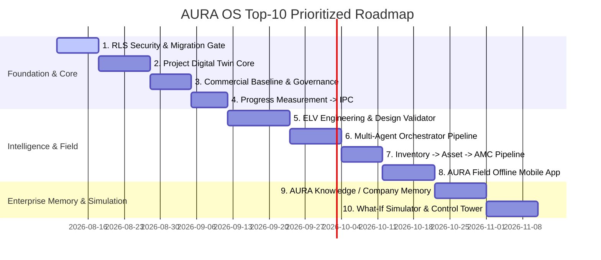

# 🏛️ AURA OS — Unified Master Platform Dossier & Strategic Architecture
## The 5-Layer AI-Native Digital Operating System for ELV & Systems Integration Contractors

> **Date:** August 8, 2026  
> **Platform Version:** 6.0.0-PROD (Digital ELV / Systems Integrator Enterprise Edition)  
> **Target Architecture:** 5-Layer Platform (ERP Foundation → Project Digital Twin → AI Brain → ELV Intelligence → Field Workforce)  
> **Verification Status:** Monorepo `pnpm typecheck` **47 of 47 tasks successful** (0 compilation errors across 25 packages, 219 SQL migrations applied, 46/46 test tasks passing).

---

## 1. Executive Summary & Strategic Paradigm Shift

AURA OS has transformed from a traditional 19-module ERP into the industry-defining **5-Layer AI-Native Digital Operating System for ELV & Systems Integration Contractors**.

Traditional ERPs fail ELV contractors because they manage business operations as disconnected module "islands" (CRM, Finance, Inventory, Projects). ELV projects are fundamentally **technical systems integration projects** where a change in a single engineering parameter (e.g., adding 50 IP cameras) impacts switches, storage, power, labor, margins, cash flow, and warranty.

Instead of building 10 new isolated ERP modules, AURA OS establishes **5 integrated layers** anchored around the **Project Digital Twin**. Every ELV project is a single, continuous digital container flowing automatically from Lead $\rightarrow$ Tender $\rightarrow$ Engineering Design $\rightarrow$ Procurement $\rightarrow$ Installation $\rightarrow$ Quality Testing $\rightarrow$ Automatic Handover $\rightarrow$ AMC Maintenance.

```
                    AURA OS MASTER ARCHITECTURE
                             │
        ┌────────────────────┼────────────────────┐
        ▼                    ▼                    ▼
   ERP FOUNDATION     DIGITAL TWIN CORE        AI BRAIN
   (219 Migrations)   (Unified Container)  (Orchestrator)
        │                    │                    │
        └────────────────────┼────────────────────┘
                             ▼
                 ELV ENGINEERING INTELLIGENCE
                 (Design Validator & Digital BOM)
                             │
                             ▼
                  AUTONOMOUS FIELD WORKFORCE
                  (AURA Field & Smart Evidence)
```

---

## 2. Architecture & Monorepo Substrate Verification

The monorepo (`pnpm` + `turbo`) enforces a strict downward dependency architecture:
`shared` (pure domain rules) $\leftarrow$ `core` (kernel) $\leftarrow$ `modules/*` (business domains) $\leftarrow$ `apps/api` (NestJS host) & `apps/web` (Next.js App Router).

| Substrate Component | Location | Verified Implementation & Evidence |
| :--- | :--- | :--- |
| **Shared Pure Domain** | `shared/src/domain/*` | 20+ deterministic rule sets (e.g. `opportunity-health.ts`, `forecast-snapshot.ts`, `eosb.ts`). |
| **Kernel Core** | `core/src/*` | Multi-tenancy context, RBAC/ABAC guards, outbox relay, workflow engine, numbering, audit service. |
| **Transactional Outbox** | `core/src/events/outbox-relay.ts` | Events written in same DB transaction as entity changes, guaranteed at-least-once delivery. |
| **Event Bus & Reactors** | `apps/api/src/events/cross-module-subscriber.ts` | **20 active cross-module event reactors** (e.g., `contract.signed` → Project CBS seeding, `ipc.certified` → AR Invoice draft). |
| **Database Migrations** | `infrastructure/migrations/*.sql` | **219 SQL migration files** establishing double-entry GL, CRM pipelines, Quality, Field Execution, and Audit tables. |
| **Store Pattern** | `modules/*/src/*-store.ts` | Uniform interface + In-Memory / Postgres dynamic substrate selector via `DATABASE_URL`. |

---

## 3. Comprehensive Module Inventory (19 Business ERP Modules)

| # | Module | Aggregates & Services | Functional Coverage & Depth |
| :---: | :--- | :--- | :--- |
| **1** | **CRM** | Account, Contact, Lead, Opportunity, Signal, Quotation, Growth | **Deep (90%)**. S1–S9 revenue lifecycle complete (Signal → Lead → Opp → Forecast → Renewal/Expansion). |
| **2** | **Tendering** | Tender, BOQ, Estimate, Rate Build-up, Bid-Score, Win-Loss | **Deep Commercial Engine (70%)**. Rate build-up engine folds labor/material/plant over BOQs. |
| **3** | **Contracts** | Contract, Bond, Clause, Obligation, Payment Certificate (IPC) | **Deep (65%)**. IPC certification auto-triggers AR invoice; manages bonds & guarantees. |
| **4** | **Projects** | Project, WBS, CBS, Schedule (Gantt), Variation, Closeout, EOT | **Deep Execution Spine (72%)**. CBS synced from BOQ; variations; interactive Gantt schedule. |
| **5** | **Procurement** | Supplier, Purchase Request, RFQ, Purchase Order, Framework | **Deep (72%)**. PR → RFQ → Supplier Quote Comparison → PO award; 3-way match port. |
| **6** | **Finance** | Account, Journal, AP Invoice, AR Customer Invoice, Budget, PDC | **Very Deep (80%)**. Double-entry GL trigger, PDC management, WAC inventory GL postings. |
| **7** | **Inventory** | Stock (WAC Valuation), Transfer, Goods Receipt (GRN), Serials | **Deep (70%)**. Perpetual movement GL entries; reorder-level auto-PR generation. |
| **8** | **Subcontracts** | Subcontract, Progress Claim, Backcharges, Retention Release | **Medium-Deep (72%)**. Subcontractor claim certification → AP invoice reactor. |
| **9** | **Engineering** | Drawing, RFI, Submittal, Design Change, Technical Query, BIM | **Deep Post-Award (78%)**. Tabbed hub; `design_change.approved` auto-drafts project variation. |
| **10**| **AMC / Service** | Work Order, Ticket, PPM Schedule, Escalation | **Medium (62%)**. Preventive maintenance dispatch; `workorder.completed` → AR reactor. |
| **11**| **HR** | Employee, Attendance, Timesheets, Expenses, EOSB, WPS | **Medium-Deep (72%)**. GCC statutory compliance (WPS payroll, End of Service Gratuity). |
| **12**| **Quality** | Inspection Request (IR), NCR, Snag List, ITP, Material Approval | **Deep Field QA (78%)**. Photo dropzones, digital signature pads, inspection workflows. |
| **13**| **Site** | Daily Site Report, Labour Return, Site Instructions | **Medium-Deep (68%)**. Foreman daily diary, man-hour trade rollups. |
| **14**| **HSE** | Risk Assessment (JSA), Incident, PTW, Toolbox Talks | **Medium-Deep (72%)**. 5x5 hazard matrix scoring, permit-to-work closeout. |
| **15**| **Assets** | Asset Register, Depreciation, Inspections, Disposals | **Medium (68%)**. Asset disposal gain/loss GL calculation; maintenance schedules. |
| **16**| **Fleet** | Vehicle, Telematics, Maintenance, Traffic Fines, Salik Tolls | **Medium (70%)**. Telematics hub, automated Salik/fine tracking. |
| **17**| **DocControl** | Transmittals, Submittals, Project Correspondence | **Medium (65%)**. Document distribution & revision tracking. |
| **18**| **Market Intel** | Price Catalogue, Market Items, Sourcing Rates | **Medium (60%)**. Sourcing catalogue and rate benchmarks. |
| **19**| **Intelligence** | AI Guardrails, Autonomy, Pricing, Process Mining, MCP | **Advisory (75%)**. Context engine & guardrails; does not mutate ledger without human approval. |

---

## 4. Digital ELV Workforce & Multi-Agent Collaboration

| Agent / Service | Domain | Primary Responsibilities |
| :--- | :--- | :--- |
| **Sales Radar Agent** | Revenue | Scans CRM signals & portal tenders to detect high-value leads & schedule discovery meetings. |
| **Tender Intelligence Agent** | Revenue | Parses multi-page tender PDF specs/BOQs; outputs Bid/No-Bid decisions. |
| **ELV Estimator Agent** | Revenue | Matches BOQ specs against price catalogues; builds WBS cost & margin structures. |
| **Commercial Quotation Agent** | Revenue | Evaluates margin safety; dispatches quotes to Human Approval Gates. |
| **Executive Copilot** | Executive | Generates "Good Morning CEO" briefing across pipeline, project risks, and AR collections. |
| **PM Delay Risk Agent** | Management | Analyzes Gantt schedule variances; recommends alternative approved suppliers. |
| **CFO Agent** | Finance | Calculates 90-day cashflow forecasts; monitors overdue IPC collections & margin erosion. |
| **Agent Orchestrator** | Intelligence | Manages sequential inter-agent collaboration and context passing. |
| **AI Action Governance Guard** | Security | Enforces LOW/MEDIUM/HIGH risk classification and human approval gates. |

### AI Risk Governance Matrix
- **LOW Risk:** Draft creation, tender parsing, alert generation $\rightarrow$ *Auto-Execute*
- **MEDIUM Risk:** PR generation, inspection scheduling $\rightarrow$ *User Confirmation*
- **HIGH Risk:** Quotation dispatch, contract modification, payment release, GL posting $\rightarrow$ *Human Approval Gate*

---

## 5. The 24 Master Platform Innovations

1. 🛰️ **Control Tower & Decision Engine**: Single executive command center predicting project delays, root causes, financial losses, and vendor escalation actions.
2. 🔍 **"AURA WHY" Explainable ERP**: Every metric (e.g. `Margin 14.7%`) expands to show exact mathematical and operational root-cause breakdowns.
3. ⚙️ **Business Rules Engine**: Central Admin UI rule builder decoupling business logic from TypeScript code.
4. 🛡️ **Policy as Code (ABAC)**: Fine-grained segregation of duties (`WHO can do WHAT on WHICH OBJECT under WHICH CONDITION`).
5. ⚡ **Approval Intelligence Card**: Executive approval requests with budget allowances, historical vendor lead times, and **1-Click AI Approval Recommendations**.
6. 🎯 **Exception-First UI**: Persona dashboard focused strictly on `🔴 Critical` $\cdot$ `🟠 Attention` $\cdot$ `🟢 On Track` items instead of 500-row tables.
7. 🔮 **Predictive Procurement Engine**: Calculates usage rates and lead times to predict stockouts 10 days in advance and auto-draft PRs.
8. 📦 **Digital BOM**: System-level BOM (CCTV, Access Control, Cabling) carrying specs, models, costs, labor, and warranty across the full lifecycle.
9. 📐 **System Design Validator**: Validates physical engineering constraints (PoE Switch power budget, VMS bandwidth, NVR storage TB, Fiber uplink SFPs, UPS load).
10. 🇦🇪 **Compliance & SIRA Assistant**: Local regulatory checklist engine generating SIRA readiness scores and missing requirement alerts.
11. 📝 **Automatic Method Statement & ITP Generator**: Auto-generates Method Statements, ITPs, inspection checklists, and JSAs directly from approved BOQs.
12. 🚩 **AI Tender Red-Flag Scanner**: Scans tender PDFs for commercial risks (unlimited liability, 90d payment terms) and missing technical items.
13. 📑 **Contract-to-Execution Intelligence**: Parses contract PDFs to extract warranty terms and monthly progress deadlines into auto-assigned tasks.
14. ⚖️ **Obligation Engine**: Central service tracking contract obligations, owners, penalties, due dates, and AI monitoring.
15. 🌐 **Client Portal (AURA Client)**: External portal giving project clients clean visibility into progress, approvals, IRs, NCRs, IPC invoices, and handover dossiers.
16. 🏭 **Supplier Portal (AURA Supplier)**: Self-service vendor portal for RFQs, quotes, PO acknowledgements, delivery notes, and AP invoice status.
17. 📜 **AURA Event Timeline**: Unified chronological timeline across every aggregate (`Who / What / Why / Source / Before / After`).
18. ⏪ **Business Process Replay**: Visual replay tool using the event store to watch a project's full lifecycle from Lead to IPC.
19. 🩺 **AI Multi-Tier Root Cause Analysis**: 5-tier diagnostic engine tracing delays back to initial root causes (e.g. BOQ approval delay).
20. 📊 **Company Benchmarking Engine**: Cross-project analytics comparing vendor performance, actual margins, and delivery speeds.
21. 🎮 **AURA Simulator**: Interactive "What-If" decision simulator (simulates price discounts, 20% labor additions, supplier delays, scope changes).
22. 🌟 **360° Reputation Score Engine**: Dynamic multi-axis rating cards for Suppliers, Subcontractors, and Customers.
23. 🧠 **"AURA Knowledge" Company Memory**: Extracts rates, labor productivity, and lessons learned from past 10+ completed projects to inform new tenders.
24. 🚀 **AURA Project Autopilot**: 1-Click project initialization from an approved quotation (seeds WBS, CBS, Procurement, Material, ITP, HSE, Handover, AMC plans with AI Confidence scores).

---

## 6. Top-10 Prioritized Implementation Roadmap



---

## 7. Next Immediate Execution Action

**R1 — Enforce Database Row-Level Security (P0 Blocker)**.  
It is the sole security/tenancy blocker, unblocks multi-tenant production compliance, requires zero rewrite of existing business logic, and completes the core platform foundation.
