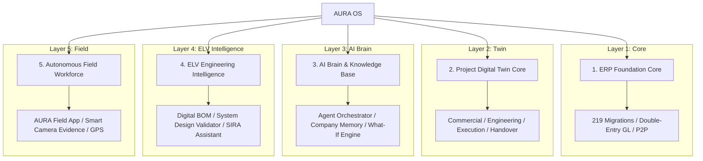
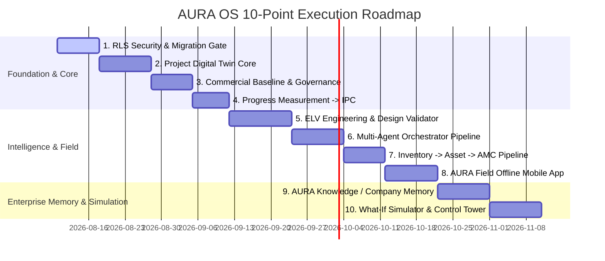

# 🏆 AURA OS — Master Architectural Manifesto: 24 Core Innovations
## The AI-Native Digital Operating System for ELV & Systems Integration Contractors

> **Architectural Vision:** Transforming AURA OS from a traditional ERP into a 5-Layer AI-Native Operating System specialized for Extra Low Voltage (ELV), MEP, and Systems Integration Contractors.  
> **Core Architectural Layers:** ERP Foundation $\rightarrow$ Project Digital Twin $\rightarrow$ AI Brain & Knowledge Graph $\rightarrow$ ELV Engineering Intelligence $\rightarrow$ Autonomous Field Workforce.



---

## 1. The 24 Master Platform Innovations

### 🛰️ 1. AURA "Control Tower" & Decision Engine
Single executive command center for CEO/PMs converting static dashboards into an interactive **Decision Engine**:
- Real-time aggregate view: Sales Pipeline, Active Projects, AR Collections, Cash Flow.
- **Predictive Risk Alerts:** E.g., *"🔴 Project X: 73% probability of delay. Root Cause: PO #124 delayed 11 days. Gantt Impact: 8 days. Financial Risk: AED 84K. Recommended Action: Supplier escalation + alternate vendor selection."*

### 🔍 2. "AURA WHY" — Explainable ERP
Every financial metric and variance is click-expandable to reveal the exact mathematical and operational root causes:
$$\text{Project Margin: 14.7\%} \xrightarrow{\text{Why?}} \begin{cases} \text{Original Margin} & 22.4\% \\ \text{Material Variance} & -3.1\% \\ \text{Labour Variance} & -2.2\% \\ \text{Variation Leakage} & -1.4\% \\ \text{Procurement Variance} & -1.0\% \end{cases}$$
Accompanied by natural language AI explanation of root-cause drivers.

### ⚙️ 3. Business Rules Engine (UI-Configurable Rules)
Decouples business logic from TypeScript code services into a central Rules Engine editable via Admin UI:
- *Example Rule:* `IF Quotation > AED 500,000 THEN Require CFO Approval AND Require Commercial Director Approval AND IF Margin < 15% THEN Trigger Board Escalation`.

### 🛡️ 4. Policy as Code (ABAC Segregation of Duties)
Enforces Attribute-Based Access Control (ABAC) defining `WHO can do WHAT on WHICH OBJECT under WHICH CONDITION`:
- *Example Policy:* `Project Manager CAN approve Inspection Request (IR) BUT CANNOT approve an IR where created_by == current_user_id`.

### ⚡ 5. Approval Intelligence Card
Transforms approval requests from plain `Approve/Reject` buttons into rich executive cards:
- Displays Request Value, Budget Allowance, Variance %, Historical Vendor Performance, Delivery Lead Time, Risk Level, and **1-Click AI Approval Recommendation**.

### 🎯 6. AURA "Exception-First UI"
Replaces dense 500-row tables with a persona-focused **My Work / Critical Exceptions** dashboard:
- Categorizes work into `🔴 Critical (3)` $\cdot$ `🟠 Attention (7)` $\cdot$ `🟢 On Track (18)`.
- Direct focus on delayed POs, uncertified IPCs, and overdue NCRs.

### 🔮 7. Predictive Procurement Engine
Monitors inventory consumption rates and supplier lead times to forecast stockouts before they happen:
- $\text{Current Stock (12)} + \text{Usage Rate (8/wk)} + \text{Lead Time (14d)} \longrightarrow \text{"⚠️ Stockout predicted in 10 days"}$.
- Automatically generates draft Purchase Requests (PR) for approval.

### 📦 8. Digital BOM (Bill of Materials)
Models every technical system (CCTV, Access Control, Cabling, BMS, PA/VA) as a structured **Digital BOM**:
- Carries Specification, Manufacturer, Model, Quantity, Unit Cost, Installation Labor, Warranty, and Serialized Asset ID cleanly across `BOQ` $\rightarrow$ `Procurement` $\rightarrow$ `Installation` $\rightarrow$ `Handover`.

### 📐 9. System Design Validator (Engineering Intelligence)
Validates physical ELV engineering constraints against manufacturer specs:
- Checks PoE Switch Power Budget, Port Capacity, VMS Bandwidth, NVR Storage TB, Fiber Uplink SFPs, IP Addressing, UPS Load.
- *Error Trigger:* `❌ PoE Power Budget exceeded by 18% on Switch SW-03 (370W / 450W capacity)`.

### 🇦🇪 10. Automatic SIRA / Local Regulatory Compliance Assistant
Region-specific regulatory engine evaluating ELV compliance (e.g. SIRA / ADMCC / Civil Defense):
- Generates **SIRA Readiness Score (e.g. 87%)** and identifies missing camera schedules, retention days, or test certificates.

### 📝 11. Automatic Method Statement & ITP Generator
Automatically generates draft technical documentation directly from approved BOQ & Digital BOM:
- Method Statements, Inspection Test Plans (ITP), Inspection Checklists, Testing Procedures, JSA Risk Assessments.

### 🚩 12. AI Tender "Red Flag Scanner"
Parses multi-page tender PDFs/BOQs to extract hidden commercial, technical, and contract risks:
- Flags unlimited liability, 90-day payment terms, ambiguous specs, or missing BOQ items, generating a composite **Tender Risk Score (e.g. 81/100 - HIGH RISK)**.

### 📑 13. Contract-to-Execution Intelligence
Parses legal contract PDFs upon signature to automatically extract operational obligations:
- Warranty timelines, monthly progress report deadlines, retention release dates $\rightarrow$ Auto-creates recurring tasks, owners, and escalation rules.

### ⚖️ 14. Obligation Engine Core Service
Centralized service tracking all contractual obligations:
- Attributes: `Owner`, `Due Date`, `Penalty Value`, `Required Evidence`, `Escalation Path`, `Linked Document`.

### 🌐 15. Client Portal (AURA Client)
Dedicated external portal for project clients:
- Clean visibility into Project Progress, Variations, Inspection Sign-offs, NCRs, IPC Invoices, Handover Dossiers (eliminating manual email updates).

### 🏭 16. Supplier Portal (AURA Supplier)
External self-service portal for vendors and subcontractors:
- Receive RFQs, submit Quotes, acknowledge POs, issue Delivery Notes, and track AP Invoice payments.

### 📜 17. AURA Event Timeline (Unified Audit Trail)
Every domain aggregate records a unified, chronological timeline:
- Captures `Timestamp`, `Actor`, `Action`, `Reason/Why`, `Source Module`, and `Before/After Diff`.

### ⏪ 18. Business Process Replay
Executive feature utilizing the append-only event store to visually **Replay** a project's full lifecycle from initial Lead signal through Tender, Contract, Execution, IPC, and AMC.

### 🩺 19. AI Multi-Tier Root Cause Analysis
Diagnoses operational failures across 5 layers:
$$\text{Project Delay} \xrightarrow{\text{Primary}} \text{PO Delayed} \xrightarrow{\text{Root}} \text{Vendor Late} \xrightarrow{\text{Underlying}} \text{RFQ Issued Late} \xrightarrow{\text{Original}} \text{BOQ Approval Delayed}$$

### 📊 20. Company Benchmarking Engine
Cross-project intelligence comparing vendor performance, actual margins, and delivery speeds:
- *Insight:* *"Projects using Supplier X deliver 11% higher average margin but experience 6 days longer delivery lead time."*

### 🎮 21. AURA Simulator (Executive Decision Simulator)
Interactive "What-If" simulation sandbox for CEOs/PMs:
- *Simulate:* Discounting price by 5%, adding 20% labor, 2-week supplier delay, or adding 50 IP cameras $\rightarrow$ Simulates immediate impact on Cost, Gantt, Cash Flow, Margin, and Penalty Risk.

### 🌟 22. 360° Reputation Score Engine
Multi-axis rating cards computed dynamically for:
- **Suppliers:** Price (82), Quality (91), Delivery (63), Response (88) $\rightarrow$ Overall 81.
- **Subcontractors & Customers:** Payment reliability, approval turnaround speed, variation behavior.

### 🧠 23. "AURA Knowledge" — Company Memory Engine
Extracts historical rates, actual labor productivity, supplier lead times, and lessons learned from past 10+ completed projects to inform new tender estimates.

### 🚀 24. AURA Project Autopilot
1-Click project initialization from an approved quotation:
- Automatically seeds `WBS`, `CBS`, `Procurement Plan`, `Material Schedule`, `ITP Plan`, `HSE Plan`, `Handover Dossier`, and `AMC Plan`, governed by **AI Confidence Scores & Human Approval Gates**.

---

## 2. Top-10 Prioritized Implementation Roadmap



---

## 3. The 5-Layer Master Architecture

```
                    AURA OS ARCHITECTURE
                             │
        ┌────────────────────┼────────────────────┐
        ▼                    ▼                    ▼
   ERP FOUNDATION     DIGITAL TWIN CORE        AI BRAIN
   (219 Migrations)   (Unified Container)  (Orchestrator)
        │                    │                    │
        └────────────────────┼────────────────────┘
                             ▼
                 ELV ENGINEERING INTELLIGENCE
                 (Design Validator & Digital BOM)
                             │
                             ▼
                  AUTONOMOUS FIELD WORKFORCE
                  (AURA Field & Smart Evidence)
```
