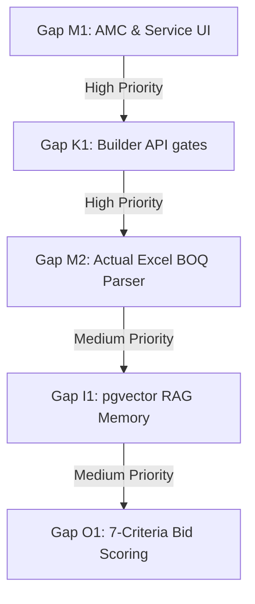

# AURA OS — Complete Master Gap Analysis Report

> **Scope:** Full comparison of the codebase against the three Master Blueprint constitutions.  
> **Status:** Analyzed across all 5 architectural layers (Kernel, Modules, Intelligence, Optimization, Experience).

---

## 1. Summary of Gaps by Layer

Below is a master scorecard showing where development stands against the complete architectural goals:

```
    L1 Kernel (Foundation)     [████████████████░░░░]  80%
    L2 Business Modules        [██████████████████░░]  90% (Backend) / 50% (UI)
    L3 Intelligence (AI)       [████████████░░░░░░░░]  60%
    L4 Optimization            [████████░░░░░░░░░░░░]  40%
    L5 Experience (Frontend)   [███████████░░░░░░░░░]  55%
```

---

## 2. Layer-by-Layer Gap Ledger

---

### L1 Kernel (Foundation) Gaps

#### Gap K1: Dynamic Workflow & Form Admin Gates
* **Description:** The backend `WorkflowOrchestratorService` and `FormRegistryService` support executing BPMN graphs and validating dynamic forms. However, the NestJS API host has no REST endpoints to register, update, or delete these definitions dynamically in the database.
* **Impact:** Form schemas and BPMN flow diagrams must be seeded manually in SQL migrations rather than managed by administrators.
* **Remedy:** Create `BuilderController` endpoints in `apps/api/src/builder/` to allow CRUD operations on `aura_builder_forms` and `aura_workflow_definitions`.

#### Gap K2: Audit Trail UI
* **Description:** State transitions and mutations write logs to the immutable `aura_audit_log` table, but there is no viewer screen to audit these logs.
* **Impact:** Developers and compliance administrators cannot audit actor history without executing raw SQL queries.
* **Remedy:** Build a `/admin/audit` route in the web shell querying `/api/audit`.

---

### L2 Business Modules Gaps

#### Gap M1: AMC & Service UI (100% Missing)
* **Description:** The `@aura/amc` package houses domains for SLAs, GIS work orders, and support tickets, but the Next.js frontend has no routes or screens for them.
* **Impact:** Work orders cannot be scheduled, assigned, or viewed on a dispatch map by operators.
* **Remedy:** Create `apps/web/app/amc/page.tsx` rendering a Leaflet/Mapbox GIS board and a ticket list.

#### Gap M2: CRM & Estimating Depth Gaps
* **Description:** Page templates exist for CRM Leads and Tenders, but missing features limit real-world usage:
  - **CRM:** Lacks marketing campaigns, pipeline stages customization, and quotation templates.
  - **Tendering:** The Excel/PDF BOQ importer is a frontend simulation. No actual server-side parser exists to extract structural elements from spreadsheets.
* **Impact:** Estimators must manually input BOQ lines line-by-line.
* **Remedy:** Add server-side multipart file uploads to `/api/tendering/tenders/[id]/boq/import` and integrate an Excel parser (e.g., `xlsx`).

---

### L3 Intelligence (AI) Gaps

#### Gap I1: pgvector RAG Memory Integration
* **Description:** The AI Context engine gathers text snapshots, but AURA OS does not store document index vectors in the database.
* **Impact:** The LLM cannot perform semantic similarity searches across the document management system (DMS) drawings and correspondence.
* **Remedy:** Install `pgvector` in PostgreSQL, create an `aura_dms_vectors` table, and write embeddings on document uploads.

#### Gap I2: Unified Observer (`*` Subscriber)
* **Description:** The Intelligence layer lacks a wildcard subscriber listening to all system events to dynamically update dashboards.
* **Impact:** Profit-Loss projections and revenue forecasts update on-demand rather than streaming updates to role portals.
* **Remedy:** Register a wildcard subscriber (`*`) in `apps/api` feeding events to the Intelligence projection engines.

---

### L4 Optimization Gaps

#### Gap O1: 7-Criteria Bid Scoring Engine
* **Description:** Tenders lack an analytical engine to score bid suitability.
* **Impact:** Management cannot systematically filter out high-risk or low-margin bids.
* **Remedy:** Build `BidScoringService` in `@aura/intelligence` evaluating: Value, Margin, Competitors, Resource Availability, Risk, Project Fit, and Working Capital.

#### Gap O2: BIM 3D model Quantity Takeoff
* **Description:** BOQ items support `ifc_guid` attributes, but there is no 3D spatial viewer.
* **Impact:** Estimators cannot click on a BOQ line and highlight the corresponding steel beam or duct in a 3D model.
* **Remedy:** Add an Autodesk Platform Services (APS) Viewer canvas component in `tender-detail.tsx`.

---

### L5 Experience (Frontend) Gaps

#### Gap E1: Multi-Company Shell Context Switcher
* **Description:** The `app-shell.tsx` top-bar renders the current tenant profile but lacks a dropdown to switch between multiple child companies.
* **Impact:** Users working across multiple subsidiaries must sign out and sign in to change contexts.
* **Remedy:** Create a company switcher dropdown in the header calling `/api/auth/switch-company`.

#### Gap E2: Theme & Table Density Control
* **Description:** Standard layouts use hardcoded CSS variables without density settings.
* **Impact:** Project detail tables with thousands of lines are difficult to read without compact spacing options.
* **Remedy:** Create a theme provider wrapping the app layout to toggle `.compact` class styling.

---

## 3. High-Priority Action Road Map

To address these gaps systematically, we recommend the following execution sequence:



---
