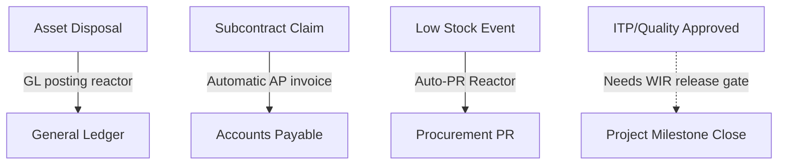

# AURA OS — Module Vertical Depth Gaps & Improvement Plan

This document details all functional, integration, and structural gaps in AURA OS modules' vertical depth, alongside concrete engineering recommendations to advance the system toward full commercial and production readiness.

---

## 1. Per-Module Functional Gaps

While core CRUD and key verticals are established, the following functional gaps remain in the business layer before the modules can match Tier-1 ERP capability:

### 1.1 Core Transactional Monolith Modules (L2)

| Module | Core Functionality Present | Remaining Gaps (Missing Verticals) |
|---|---|---|
| **Finance** | GL, AP/AR, bank reconciliation, petty cash, tax, budgeting, period close, statements. | • **Intercompany Eliminations:** SUM consolidation exists, but automated contra-account elimination is absent. • **Transaction FX:** Rate registry conversion exists, but direct transaction-level multi-currency entries are limited. |
| **Projects** | Setup, WBS/CBS, EVM, delay tracking, variations, schedule baselines. | • **Resource Levelling:** Automated labor/plant scheduling limits matching project timelines. • **Gantt Backend:** Schedule UI is present, but fully reactive schedule rescheduling algorithms are missing. |
| **Procurement** | PR, RFQ, PO, supplier master, threshold approval matrix, 3-way match. | • **Blanket Agreements:** Support for long-term framework agreements / volume pricing schedules. • **3-Way Match Hard-Gate:** Server-side API rejects invoice creation if matching tolerance (>2% variance) is exceeded. |
| **Inventory** | GRN, transfers, WAC valuation, reorder alerts. | • **FIFO Cost Layers:** Currently defaults to WAC (Weighted Average Cost). FIFO layer tracking is unbuilt. • **Barcoding & Multi-UOM:** Unit of Measure converters and barcode scanner parsing. |
| **HR** | Employees, leave, timesheets, payroll, UAE WPS SIF files. | • **Performance Appraisal:** Employee evaluation cycles. • **Org Chart Generation:** Dynamic hierarchy trees from manager-reporting paths. |
| **Contracts** | Contract setup, IPC billing to AR. | • **Clause Library:** Template library for contract terms and legal boilerplate. • **Obligation Tracking:** Milestones/notifications for compliance deliverables. |
| **Tendering** | Tender setup, BOQ, bid scoring. | • **Estimate Engine:** Detailed cost build-up (material + labor + subcon estimation templates). • **Competitor Analysis:** Tender win/loss analytics. |
| **Subcontracts** | Subcontracts, claims, variations, back-charges. | • **Retention-Release UI:** Front-end controls to release held subcon retention inside progress claims. |
| **AMC** | Contracts, PPM, work orders, tickets, AR billing. | • **SLA Timer Depth:** Real-time SLA breach countdowns, reminders, and escalation paths. |

### 1.2 Operational Bounded Contexts

| Module | Core Functionality Present | Remaining Gaps (Missing Verticals) |
|---|---|---|
| **Doc-Control** | Transmittals, correspondence, register. | • **Transmittal History Linkage:** Tracking historical revisions of drawing sheets directly within transmittal packages. |
| **Engineering** | Drawings, RFIs, submittals, TQ. | • **Model Viewer:** Support for IFC/BIM file rendering inside the browser/UI. • **Submittal-to-Drawing Link:** Automated drawing revisions when submittals are approved. |
| **Quality** | NCR, inspections, snags, ITP, MAR, calibration. | ✅ **Audit Schedules:** ISO checklist scheduler and non-conformance ticket generators. |
| **Fleet** | Vehicles, fuel, maintenance, Salik, fines. | ✅ **GPS Telematics & Expirations:** Webhook receivers for real-time location telemetry data, vehicle coordinates snapshot mapping, and automated Mulkiya registration renew tasks. |
| **HSE** | Incidents, PTW, CAPA, toolbox talks, risk assessments. | ✅ **HSE Training Matrix:** Tracking worker safety inductions, card validity, and certifications inside HSE Control. |
| **Assets** | Assets register, depreciation, disposal. | • **Disposal GL Posting Reactor:** Automatic journal entries for capital asset write-offs (depreciation recovery/scrap gain). • **QR Tagging:** Generating inventory tags. |
| **Site** | Daily diaries, delays, materials, labor allocation. | ✅ **Progress % Mapping:** Visual progress metrics vs planned baselines inside Site Control. |

---

## 2. Cross-Module Integration Gaps

Modular boundaries are maintained by communicating strictly via event reactors (`cross-module-subscriber.ts`). However, several key business loops are currently unlinked:

### 2.1 Missing Reactors
1. **Asset Disposal → Finance GL:**
   * *Status:* ✅ Resolved. Added cross-module subscriber that auto-posts balanced GL journals.
2. **Subcontract Claims → Finance AP:**
   * *Status:* ✅ Resolved. Added cross-module subscriber that auto-drafts supplier invoices on claim certification.
3. **Quality Check (MAR/ITP) → Procurement PO:**
   * *Status:* Quality verifies Material Approval Requests, but Procurement can issue purchase orders for unapproved manufacturers. Needs a hard gate.

---

## 3. Structural & Architectural Improvements

To transition modules from prototype CRUD to enterprise-grade monolith components:

### 3.1 Migration from Aggregate to Per-Entity Stores
Eight modules utilize the **Aggregate Store Pattern** where a single repository maps multiple domain models. As these grow, this creates bottleneck files:
* *Candidates for separation:* **HR** (currently packing 11 domain models like Leave, WPS, Timesheet, Attendance in `postgres-hr-store.ts`) and **Quality** (packing NCR, Snags, MAR, Calibrations in `postgres-quality-store.ts`).
* *Action:* Separate into dedicated `postgres-attendance-store.ts`, `postgres-calibration-store.ts`, etc.

### 3.2 Standardizing Infrastructure across Modules
1. **Pagination Rollout:**
   * *Current Status:* Standardized pagination (`PageParams`, limit, offset) is active on CRM, Procurement, Inventory, Finance, Projects, Contracts, Tendering, Engineering, `fleet`, `assets`, `quality`, and `site`.
   * *Gaps:* `subcontracts`, `hr`, `hse`, `amc` still rely on unpaginated/default-limit lists.
2. **Global ValidationPipe & DTO Schemas:**
   * *Current Status:* NestJS `ValidationPipe` is registered, but only a few DTOs (e.g. Finance `CreateInvoiceDto`) use class-validator decorators.
   * *Gaps:* Most controllers (e.g., Projects, Procurement, CRM) use plain TypeScript interface arguments, meaning validation rests on manual `if` guards.
3. **Soft-Delete Support:**
   * *Status:* Deleting records currently fires absolute database deletes. We need to introduce an audit-safe `deleted_at` soft-delete protocol across all modules.

---

## 4. Test & Verification Coverage Gaps

While unit test depth is excellent in core domains, operational module coverage is thin:

> [!WARNING]
> Operational risk is concentrated in L2 modules with low test counts:
> * **Engineering:** Only 1 test file covers drawings/RFI/submittals/TQ.
> * **HSE:** 2 test files.
> * **Site:** 2 test files.
> * **Doc-Control:** 2 test files.

### 4.1 Integration & E2E Testing
* **Database Integration Testing:** Almost all module tests use in-memory repository doubles. Real database behaviors (such as transaction rollbacks, unique constraints, and postgres-specific triggers) are unchecked in tests.
* **HTTP E2E Testing:** No Supertest/Playwright layer exists in CI to trace HTTP routes `/api/v1/...` end-to-end.
