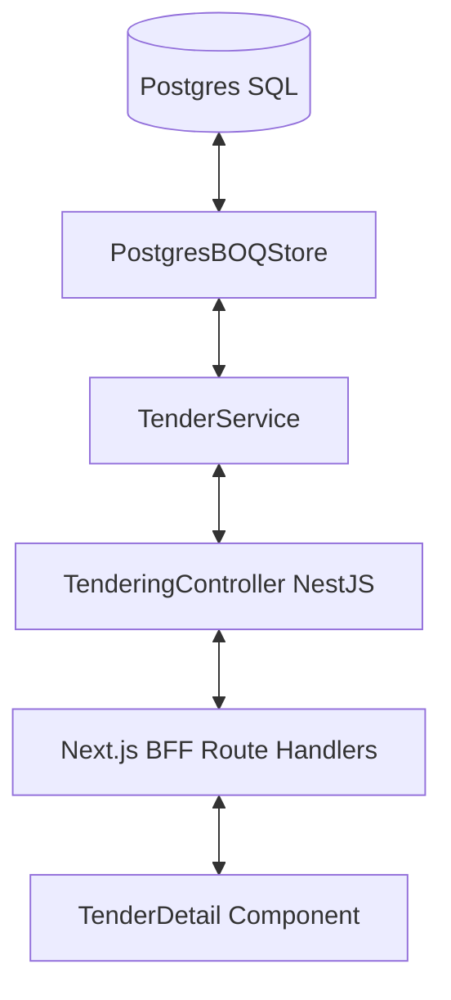

# Tendering Depth: BOQ & Cost Estimating Walkthrough

We have successfully implemented the **Bill of Quantities (BOQ) and Cost Estimating** workflows under **Phase 7: Business Module Depth**. This bridges the gap in the Tendering module by enabling detailed line-item estimation, natural hierarchical sorting, automated closed-loop value updates, and a simulated AI OCR/Excel import tool.

---

## 1. Architecture Overview

Here is how the data flows from the database up to the user interface:

### Key Highlights
- **Automatic closed-loop estimation**: Adding, editing, or deleting a BOQ line item automatically recalculates the total tender cost value, updates the database, and publishes a `tendering.tender.updated` event to the system events spine.
- **Hierarchical tree structure**: Sorts items naturally by their dot-hierarchy code (e.g. `1.1` before `1.1.2`, before `1.2`), matching standard civil estimation formats.
- **BIM-to-BOQ linkage**: Allows assigning IFC GUIDs to individual BOQ items, setting the stage for Gap 6 BIM linkage.

---

## 2. Core Implementation Components

### A. Database Migration
We added migration `infrastructure/migrations/0042_tendering_boq.sql` with the following structure:
- `aura_tendering_boqs`: One-to-one mapping with the `aura_tendering_tenders` table.
- `aura_tendering_boq_items`: Stores individual estimating lines with columns for quantity, unit rate, total amount, and `ifc_guid`.
- **Security**: Row Level Security (RLS) is enabled, enforcing tenant-isolation based on `current_tenant_id()`.

### B. Domain Models
Inside `modules/tendering/src/domain/boq.ts`:
- Defined factory methods `makeBOQ` and `makeBOQItem` with data coercion and validation (e.g., preventing negative quantities/rates, enforcing non-empty codes).

### C. Repositories & Services
- `modules/tendering/src/boq-store.ts`: Store interface supporting both PostgreSQL and In-Memory storage.
- `modules/tendering/src/tender.service.ts`: Extended to support `getOrCreateBOQ`, `addBOQItem`, `updateBOQItem`, `deleteBOQItem`, and `importBOQItems`. Includes the private helper `recalculateTenderValue` which fires the spine event on update.

### E. NestJS API & Next.js BFF Proxy
- `tendering.controller.ts` (`apps/api`): Exposed REST endpoints for CRUD operations on BOQ items.
- Added BFF Route Handlers for the Next.js frontend proxy:
  - `GET/POST` at `apps/web/app/api/tendering/tenders/[id]/boq/route.ts`
  - `POST` at `apps/web/app/api/tendering/tenders/[id]/boq/import/route.ts`
  - `PUT/DELETE` at `apps/web/app/api/tendering/tenders/[id]/boq/items/[itemId]/route.ts`

---

## 3. UI Dashboard Features

We built a state-of-the-art interactive detail page for each Tender at `/tendering/tenders/[id]` containing:
1. **Header Overview**: Shows the reference code, title, customer account name, status, and the live cost estimate rollup.
2. **Status Transition Panel**: Submit tender, mark as won (awarded), or mark as lost.
3. **Structured Spreadsheet Table**:
   - Depth-based indenting for hierarchical codes.
   - Inline editing for codes, descriptions, units, quantities, rates, and BIM links.
   - Inline add/delete lines.
4. **✦ AI Import Panel**:
   - A modal interface simulating OCR analysis of PDF/Excel tenders.
   - Animates step-by-step progress through document layout scanning, cost DB cross-referencing, and final structuring.
