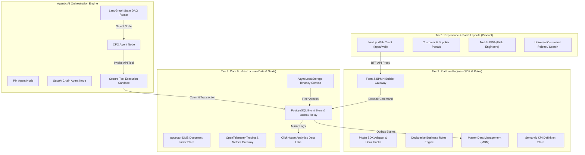
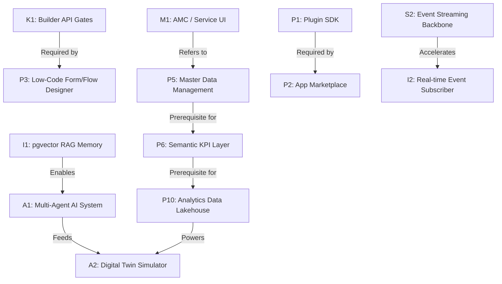

# AURA OS — Unified Master Gap & Strategic Enhancement Report (v4.0)
## The Ultimate Platform Constitution & Architecture Blueprint

> **Document Class:** Strategic Platform Architecture, SaaS Transformation, & Agentic AI Blueprint  
> **AURA OS Target:** Evolution from a Bounded Enterprise ERP + AI system to a global **Enterprise Operating System Platform** (SAP + Salesforce + ServiceNow + Power Platform in one unified engine).

---

## 1. System Blueprints & Visual Architecture Map

This section establishes the visual maps showing how AURA OS elements interact across layers.

### 1.1 The North Star Architecture Map



---

### 1.2 Core Architectural Dependency Graph

This graph details the sequence of technical dependencies. An arrow indicates that the source must be completed before the target can begin.



---

## 2. Three-Tier Gap Classification System

To prevent blending features with core infrastructure, we segment all current gaps into three distinct layers.

### Tier A: Product Layer (End-User Features & Interfaces)
* **AMC / Service Workspace UI:** No frontend routes or dispatch board screens exist under `/amc` or `/service`.
* **Actual Server-Side BOQ Parser:** The Excel importer is a frontend simulation without server-side parsing.
* **Audit Trails Dashboard UI:** No web client dashboard to browse the `aura_audit_log` records.
* **Multi-Company Context Switcher:** No header widget to switch between active subsidiaries.

### Tier B: Platform Layer (SDKs, Low-Code & API Gates)
* **Plugin SDK & Runtime Hook Interceptors:** Codebase lacks standard hooks/adapters for installing external packages.
* **Dynamic Builder API & Admin Gates:** Missing API endpoints to register, version, or update form schemas and workflows dynamically.
* **Low-Code Visual Designers:** No drag-and-drop form builders or visual BPMN diagram designers.
* **App Marketplace Schema:** Lacks a package registry and catalog metadata schema.
* **Master Data Management (MDM):** No single source of truth to sync customer, supplier, and material logs across modules.
* **Semantic KPI Metrics Layer:** Lacks metadata definitions to unify KPI formulations (e.g., net margin, gross profit).
* **Business Rules Engine (BRE):** Rules are coded inside domain entities rather than processed via a declarative runtime.

### Tier C: Infrastructure Layer (Data, Scale & Telemetry)
* **pgvector RAG Embeddings Storage:** No vector storage configured to run semantic searches.
* **Low-Latency Event Streaming Backbone:** Outbox Relays rely on transactional SQL polling rather than real-time brokers (e.g., Redis Streams/NATS).
* **OpenTelemetry Centralized Observability:** Lacks standardized tracing and metrics collectors.
* **Analytics Data Lakehouse:** No data pipeline exporting transactional Postgres records to an OLAP database.

---

## 3. Impact / Effort / Risk Matrix

We prioritize tasks based on their strategic impact, implementation effort, and risk factors:

| Gap Code | Initiative Title | Tier | Strategic Impact | Dev Effort | Risk Level | Priority |
| :--- | :--- | :--- | :--- | :--- | :--- | :--- |
| **M1** | AMC & Service UI | Product | High | Medium | Low | **P1 (Urgent)** |
| **K1** | Builder API Gates | Platform | High | Medium | Medium | **P1 (Urgent)** |
| **M2** | Server-Side BOQ Ingestion | Product | High | Low | Low | **P1 (Urgent)** |
| **E1** | Multi-Company Switcher | Product | Medium | Low | Low | **P1 (Urgent)** |
| **P5** | Master Data Management (MDM) | Platform | High | Medium | High | **P2 (High)** |
| **I1** | pgvector RAG Memory | Infrastructure| High | Medium | Medium | **P2 (High)** |
| **P9** | Business Rules Engine (BRE) | Platform | Medium | High | Medium | **P2 (High)** |
| **P6** | Semantic KPI Layer | Platform | High | Medium | Low | **P2 (High)** |
| **O1** | 7-Criteria Bid Scorer | Product | Medium | Medium | Low | **P3 (Medium)** |
| **P1** | Plugin SDK | Platform | Critical | High | High | **P3 (Medium)** |
| **P10**| Analytics Data Lakehouse | Infrastructure| High | High | Low | **P4 (Future)** |
| **P2** | App Marketplace | Platform | Medium | High | Medium | **P4 (Future)** |

---

## 4. SaaS Commercial & Pricing Strategy

AURA OS targets scaling globally via a multi-tenant subscription plan model. Features are dynamically gated based on subscription packages:

| Feature / Capability | Core Plan | Professional Plan | Enterprise Plan |
| :--- | :--- | :--- | :--- |
| **Active Modules** | CRM, Tendering, Projects, HR, Finance | + Procurement, Subcontracts, Assets, AMC | + Complete Composable Platform Stack |
| **Tenancy Limits** | 1 Database Schema / Single Company | Multi-Company contexts (Switcher active) | Dedicated Postgres Instance / Global router |
| **AI Assistants** | Centralized Chatbot (General context) | `pgvector` Document RAG search | Multi-Agent DAGs & Automated Operations |
| **BPMN Workflow Designer** | Read-Only Default Engine templates | Custom workflow rule parameters | Full Visual drag-and-drop Workflow Designer |
| **Analytics & BI** | In-Memory summary calculations | Automated Daily Projections | Live ClickHouse OLAP Data Lakehouse |
| **Pricing Anchor** | **$49 / user / month** | **$99 / user / month** | **$199 / user / month** |

---

## 5. Agentic AI Production Governance & Budgeting

To ensure stability, the Multi-Agent system incorporates governance controls:

```
                            [ AGENT DECISION NODE ]
                                       │
                                       ▼
                       ┌──────────────────────────────┐
                       │    LLM Spend & Rate Limit    │
                       │     (Check Token Quota)      │
                       └──────────────┬───────────────┘
                                      │ (Under Limit)
                                      ▼
                       ┌──────────────────────────────┐
                       │    Tool Registry Registry    │
                       │   (Inspect Permission Scope) │
                       └──────────────┬───────────────┘
                                      │ (Authorized)
                                      ▼
                       ┌──────────────────────────────┐
                       │  Secure Isolation Sandbox   │
                       │   (Executes Transaction)     │
                       └──────────────────────────────┘
```

* **Tool Registry Governance:** Every tool (e.g. `issuePO`, `certifyPayment`) registers a schema mapping its target controller endpoint. The AI Guardrails engine validates permissions before executing tools.
* **Agent Rate Limiting:** Enforces maximum request limits per agent, tenant, and IP address to prevent loop errors from draining resources.
* **LLM Spend Control (Token Budgets):** Sets maximum dollar-value quotas per tenant per billing cycle. If a tenant's usage exceeds their limit, LLM operations degrade gracefully to rule-based fallback actions.

---

## 6. Observability, Tracing, & Correlation Schema

AURA OS uses standardized headers to trace requests across the asynchronous Event Spine:

```
    [ HTTP Request / Header ]  ───►  Set `x-correlation-id` and `x-tenant-id`
                                              │
                                              ▼
    [ Command Bus execution ]  ───►  Attach ID to Command Payload
                                              │
                                              ▼
    [ Write Event Outbox ]     ───►  Persist ID inside `aura_events` table
                                              │
                                              ▼
    [ AI Agent Execution ]     ───►  Log ID inside `aura_ai_decision_log`
```

1. **Correlation IDs:** Incoming requests generate or pass a unique `x-correlation-id`. This ID is attached to commands, outbox events, and audit logs.
2. **Distributed Tracing:** Generates traces across the API gateway down to database transactions, making it easy to identify latency issues.
3. **AI Decision Logging:** Agent calculations, routing decisions, prompt templates, and tool calls are saved to the `aura_ai_decision_log` table, preserving an audit trail for all AI-driven actions.

---

## 7. Composable Plugin SDK & Isolation Sandbox

* **Plugin Lifecycle Hooks:** Plugins hook into core lifecycles via defined hook keys:
  - `discover`: Scans folder definitions and imports metadata.
  - `install`: Registers custom tables and triggers schema updates.
  - `run`: Mounts custom controllers, injectors, and event subscribers.
  - `stop` / `uninstall`: Safely unmounts dependencies without impacting core systems.
* **Versioning Model:** Follows strict Semantic Versioning. Core upgrades check plugin dependency maps to prevent conflicts.
* **Sandbox Isolation:** Third-party plugins execute queries through isolated database schemas. They cannot call core entities directly; instead, they interact via the standard REST Gateway or the L1 Event Bus.

---

## 8. Operational Transformation Roadmap

### Phase 1: Operational Completion (Product Layer)
* Build `/amc` and `/service` UI pages.
* Deploy NestJS `BuilderController` endpoints.
* Implement server-side Excel parsing for BOQ imports.
* Add the `/admin/audit` log dashboard and company context switcher.

### Phase 2: Intelligence & Optimization (AI Layer)
* Integrate `pgvector` and configure RAG storage.
* Build the 7-Criteria Bid Scoring Engine.
* Set up a low-latency Event Streaming Backbone (Redis Streams/NATS).
* Integrate the Autodesk 3D Model Viewer canvas.

### Phase 3: Platform Transition (Platform Layer)
* Implement the Plugin SDK adapter framework.
* Standardize the App Marketplace schema.
* Build the Master Data Management (MDM) service.
* Deploy the Low-Code visual form/workflow builders.

### Phase 4: Global Scaling (Infrastructure Layer)
* Export event data to a ClickHouse Analytics Data Lakehouse.
* Deploy the distributed Multi-Agent AI system.
* Configure OpenTelemetry dashboards.

---
