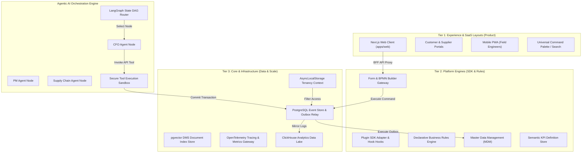
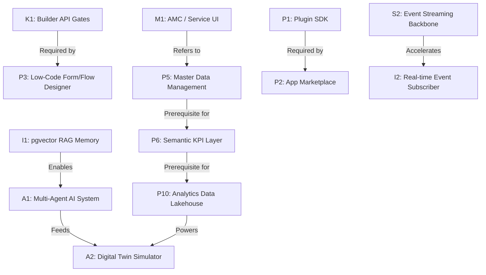

# AURA OS — Unified Master Gap & Strategic Enhancement Report (v6.0)
## Definitive Production & Platform Constitution

> **Document Class:** Strategic Platform Architecture, SaaS Implementation, & Complexity Mitigation Blueprint  
> **Target:** Finalizing the AURA OS roadmap into an executable, secure, and commercially viable platform, establishing the "Killer Feature," and outlining paths for event streaming and plugin governance.

---

## 1. System Blueprints & Visual Architecture Map

This section establishes the visual maps showing how AURA OS elements interact across layers.

### 1.1 The North Star Architecture Map



---

### 1.2 Core Architectural Dependency Graph

This graph details the sequence of technical dependencies. An arrow indicates that the source must be completed before the target can begin.



---

## 2. The Killer Feature: Autonomous Closed-Loop Estimation & Financial Reconciliation

To successfully capture the enterprise market, AURA OS focuses on a single **Killer Feature**:

```
                       ✦ THE AUTONOMOUS FINANCIAL SPINE ✦
   [ AI Ingestion Parser ] ──► [ Calibrated BOQ Rates ] ──► [ Real-Time EVM/CBS ] ──► [ Balanced General Ledger ]
```

### High-Impact Value Proposition:
1. **AI-Ingested Estimating:** Upload complex PDF/Excel tenders. The system parses structural elements and estimates costs using the 4-layer pricing engine.
2. **Closed-Loop Cost Commitments:** Purchase Orders and subcontractor claims are automatically matched against BOQ items, updating the project CBS in real-time.
3. **Automated Ledger Posting:** Site progress updates and invoice approvals trigger balanced double-entry journal postings without human data entry.
4. **Autonomous Profit & Loss Forecasting:** The system projects project P&L and cash flows by comparing contract values against committed spend and invoices.

---

## 3. Real-Time Event Streaming Graduation Roadmap

AURA OS uses a structured path to upgrade the event spine as system volume increases:

```
  Stage 1: SQL Polling (Monolithic)  ├── Polls `aura_events` using `SKIP LOCKED` rows query.
                                     └── Handles up to 2,000 transactions/second.
                                           │
                                           ▼ (Over 2k transactions/second)
  Stage 2: Redis Streams (Scale)     ├── Migrate event outbox to Redis Streams.
                                     └── Reduces database write loads.
                                           │
                                           ▼ (Over 10k transactions/second)
  Stage 3: NATS JetStream (SaaS)     ├── Decouple modules into isolated containers.
                                     └── Direct event traffic through NATS.
```

---

## 4. Third-Party Plugin Certification & Lifespan Governance

To secure the platform's extension ecosystem against malicious or resource-intensive plugins, AURA OS enforces four security measures:

1. **The Extension Sandbox:** Plugins run inside isolated worker threads with strict memory limits (256MB max) and execution timeouts (3 seconds max per call).
2. **Dynamic DB User Roles:** Plugins execute database queries using read-only schemas. They are blocked from accessing core tables.
3. **The Hook Approval Pipeline:** Hook calls must pass validation checks against the system schema registry before execution.
4. **App Marketplace Review:** Third-party extensions are reviewed and signed using secure keys before they can be installed.

---

## 5. Complexity Mitigation & Over-Engineering Safeguards

To prevent scope creep and maintain development focus, AURA OS enforces four complexity limits:

1. **Defer Infrastructure Escalation:** Rely on PostgreSQL event store polling instead of deploying NATS or Kafka brokers until concurrent event volumes exceed 10,000 writes/second.
2. **Limit LLM Dependencies:** The core application must run independently of LLM API availability. AI agents are treated as asynchronous helpers; if they are offline, core ERP rules remain fully operational.
3. **Monolithic Package Scaffolding:** Modules remain hosted inside the single monorepo (`modules/*`) using TypeScript compiler paths. Do not separate them into isolated microservice repositories until deployment requirements demand it.
4. **Relational Read Projections:** Use Postgres indexes and materialized views to handle analytical queries. Defer ClickHouse data lake integration until analytical data sizes exceed 5 Terabytes.

---

## 6. High-Priority 30-60 Day MVP Execution Plan

This tactical plan defines the steps to launch the first stable release:

```
  Weeks 1-2: Foundation Hardening  ├── Builder API REST Gates · Multi-Company Switcher · Audits
  Weeks 3-4: Service Operations   ├── AMC / Service Dashboard · GIS Map Dispatch Pins
  Weeks 5-6: Est. Data Ingestion  ├── Server-Side Excel BOQ Parser · Recalculation Engine
  Weeks 7-8: Core Verification    ├── pgvector RAG Storage · Autonomy Queue UI Integration
```

### Weeks 1-2: Core Hardening & Security Gates
* **Deliverables:**
  - Build `BuilderController` endpoints in `apps/api` to enable CRUD operations on form templates and workflow matrices.
  - Implement the multi-company session context switcher in the frontend header.
  - Expose the `/admin/audit` log viewer.

### Weeks 3-4: AMC / Service Operations UI
* **Deliverables:**
  - Create the `/amc` and `/service` routes.
  - Build an interactive dispatch board displaying active work orders on a Mapbox canvas.
  - Expose ticket SLA timers and priority indicators.

### Weeks 5-6: Structured Estimating Data Ingestion
* **Deliverables:**
  - Implement a multipart file upload handler in NestJS to parse Excel BOQs using the `xlsx` library.
  - Connect parsed items directly to the database and trigger cost recalculations.

### Weeks 7-8: Basic AI Integration
* **Deliverables:**
  - Deploy `pgvector` in PostgreSQL and run document searches in the DMS.
  - Integrate the Autonomy Proposal Queue into the UI, allowing operators to execute or reject proposals.

---

## 7. Unified System Gaps Ledger

All current gaps are grouped into Product, Platform, and Infrastructure tiers:

### Tier A: Product Layer (End-User Features & Interfaces)
* **AMC / Service Workspace UI:** No frontend routes or dispatch board screens exist under `/amc` or `/service`.
* **Actual Server-Side BOQ Parser:** The Excel importer is a frontend simulation without server-side parsing.
* **Audit Trails Dashboard UI:** No web client dashboard to browse the `aura_audit_log` records.
* **Multi-Company Context Switcher:** No header widget to switch between active subsidiaries.

### Tier B: Platform Layer (SDKs, Low-Code & API Gates)
* **Plugin SDK & Runtime Hook Interceptors:** Codebase lacks standard hooks/adapters for installing external packages.
* **Dynamic Builder API & Admin Gates:** Missing API endpoints to register, version, or update form schemas and workflows dynamically.
* **Low-Code Visual Designers:** No drag-and-drop form builders or visual BPMN diagram designers.
* **App Marketplace Schema:** Lacks a package registry and catalog metadata schema.
* **Master Data Management (MDM):** No single source of truth to sync customer, supplier, and material logs across modules.
* **Semantic KPI Metrics Layer:** Lacks metadata definitions to unify KPI formulations (e.g., net margin, gross profit).
* **Business Rules Engine (BRE):** Rules are coded inside domain entities rather than processed via a declarative runtime.

### Tier C: Infrastructure Layer (Data, Scale & Telemetry)
* **pgvector RAG Embeddings Storage:** No vector storage configured to run semantic searches.
* **Low-Latency Event Streaming Backbone:** Outbox Relays rely on transactional SQL polling rather than real-time brokers (e.g., Redis Streams/NATS).
* **OpenTelemetry Centralized Observability:** Lacks standardized tracing and metrics collectors.
* **Analytics Data Lakehouse:** No data pipeline exporting transactional Postgres records to an OLAP database.

---

## 8. SaaS Commercial & Pricing Strategy

Features are dynamically gated based on subscription packages:

| Feature / Capability | Core Plan | Professional Plan | Enterprise Plan |
| :--- | :--- | :--- | :--- |
| **Active Modules** | CRM, Tendering, Projects, HR, Finance | + Procurement, Subcontracts, Assets, AMC | + Complete Composable Platform Stack |
| **Tenancy Limits** | 1 Database Schema / Single Company | Multi-Company contexts (Switcher active) | Dedicated Postgres Instance / Global router |
| **AI Assistants** | Centralized Chatbot (General context) | `pgvector` Document RAG search | Multi-Agent DAGs & Automated Operations |
| **BPMN Workflow Designer** | Read-Only Default Engine templates | Custom workflow rule parameters | Full Visual drag-and-drop Workflow Designer |
| **Analytics & BI** | In-Memory summary calculations | Automated Daily Projections | Live ClickHouse OLAP Data Lakehouse |
| **Pricing Anchor** | **$49 / user / month** | **$99 / user / month** | **$199 / user / month** |

---

## 9. Agentic AI Production Governance & Budgeting

To ensure stability, the Multi-Agent system incorporates governance controls:

* **Tool Registry Governance:** Every tool (e.g. `issuePO`, `certifyPayment`) registers a schema mapping its target controller endpoint. The AI Guardrails engine validates permissions before executing tools.
* **Agent Rate Limiting:** Enforces maximum request limits per agent, tenant, and IP address to prevent loop errors from draining resources.
* **LLM Spend Control (Token Budgets):** Sets maximum dollar-value quotas per tenant per billing cycle. If a tenant's usage exceeds their limit, LLM operations degrade gracefully to rule-based fallback actions.

---

## 10. Observability, Tracing, & Correlation Schema

AURA OS uses standardized headers to trace requests across the asynchronous Event Spine:

1. **Correlation IDs:** Incoming requests generate or pass a unique `x-correlation-id`. This ID is attached to commands, outbox events, and audit logs.
2. **Distributed Tracing:** Generates traces across the API gateway down to database transactions, making it easy to identify latency issues.
3. **AI Decision Logging:** Agent calculations, routing decisions, prompt templates, and tool calls are saved to the `aura_ai_decision_log` table, preserving an audit trail for all AI-driven actions.

---
